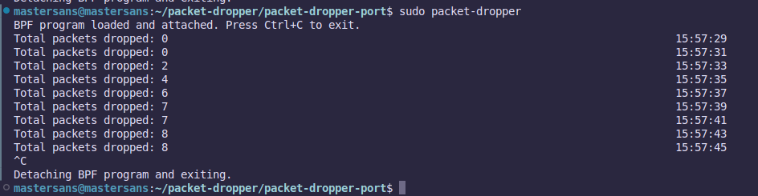

# Packet Dropper



Below command used to test out the tool.
```css
echo "Test" | nc -v localhost 4040
```
## Overview
The Packet Dropper tool (packet-dropper) is a command-line utility designed to drop incoming network packets on a specified port using eBPF (Extended Berkeley Packet Filter) technology. This tool can be useful for testing network security configurations or implementing custom packet filtering logic.

## Automatic Installation (Using install.sh)
To install packet-dropper automatically, follow these steps:

1. Clone the Repository: Clone the packet-dropper repository to your local machine.
```bash
git clone https://github.com/mastersans/packet-dropper.git
```

2. Navigate to the Repository: Change to the directory containing the packet-dropper source code.
```bash
cd packet-dropper-port
```

3. Run the Install Script: Execute the install.sh script to automatically install the tool and its dependencies.
```bash
./install.sh
```

## Manual Installation
To install packet-dropper manually, follow these steps:

1. Clone the Repository: Clone the packet-dropper repository to your local machine.
```bash
git clone https://github.com/mastersans/packet-dropper.git
```

2. Navigate to the Repository: Change to the directory containing the packet-dropper source code.
```bash
cd packet-dropper-port
```

3. Install Prerequisites: Ensure that the necessary prerequisites (Clang/LLVM, Go, and BPF headers) are installed on your system. You can install them using your system's package manager.
```bash
sudo apt update
sudo apt install -y clang llvm golang
```

4. Build the Go Binary: Build the packet-dropper binary using the Go compiler.
```bash
go mod download
go build -o packet-dropper packet_drop.go
```

5. Compile the eBPF Program: Compile the eBPF program (packet_drop.c) using the provided Makefile or manually with the following command:
```bash
clang -O2 -g -Wall -target bpf -c packet_drop.c -o packet_drop_kern.o
```

6. Move Files to System Directories: Move the packet-dropper binary and the eBPF object file to appropriate system directories.
```bash
sudo mv packet-dropper /usr/local/bin/
sudo mkdir -p /etc/packet-dropper/
sudo mv packet_drop_kern.o /etc/packet-dropper/
```

## Usage
The packet-dropper tool can be invoked with the following command-line options:

```css
sudo packet-dropper [OPTIONS]
```

Options:
- `--interface <interface>`: Specifies the network interface to attach the eBPF program. Defaults to eth0.
- `--port <port>`: Specifies the port number on which to drop incoming packets. Defaults to 4040.
- `--ebpf-file <file>`: Specifies the path to the eBPF object file. Defaults to /etc/packet-dropper/packet_drop_kern.o.
- `--help`: Displays help information.
- `--list-interfaces`: Lists available network interfaces.

Example:
```bash
sudo packet-dropper --interface ens33 --port 8080
```
This command starts packet-dropper on interface ens33, dropping incoming packets on port 8080.
